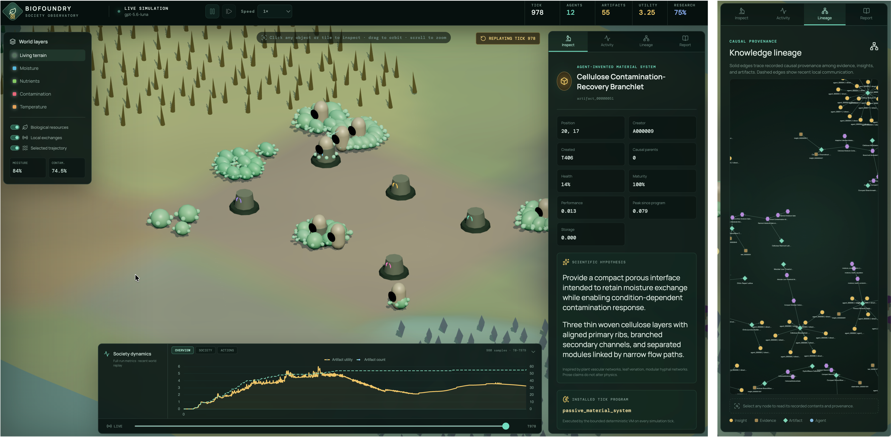

# SwarmWorld

SwarmWorld is a deterministic research environment for studying how societies of
language-model agents discover, test, exchange, inherit, and physically embody
technologies in a shared world. Agents perceive locally, act through a bounded action
contract, and leave persistent artifacts whose material effects and executable
programs continue on later simulation ticks.



This repository is the clean source-code release. The approximately 8.4 GB paper
dataset - authoritative traces, manifests, seed-level tables, derived analyses, and
final figures - is released separately at
[lamm-mit/swarmworld-data](https://huggingface.co/datasets/lamm-mit/swarmworld-data).
See [DATA.md](DATA.md) for the code/data boundary and download examples.

The historical Python package and command name is `biofoundry`; it is retained for
trace, import, and command-line compatibility. The public project and repository are
named SwarmWorld.

## What is included

- authoritative Python simulator and PettingZoo interface;
- scripted and OpenAI-compatible LLM policies;
- exact event traces, deterministic replay, counterfactual replay, and integrity checks;
- controlled multi-condition study runner and seed-level analysis;
- artifact programs, program inheritance, causal knowledge records, and held-out
  ecological evaluation;
- Three.js Observatory, optional Godot client, and human-in-the-swarm client;
- declarative scenario packages, including the Ashen Realms example;
- core Python and browser tests.

Generated study data, journal-figure pipelines, reports, movies, caches, and local
development state are intentionally not bundled.

## Install

SwarmWorld requires Python 3.10 or newer. Python 3.12 is the reference release
environment.

```bash
git clone https://github.com/lamm-mit/SwarmWorld.git
cd SwarmWorld
python -m venv .venv
source .venv/bin/activate
python -m pip install --upgrade pip
python -m pip install -e ".[dev,analysis]"
biofoundry doctor --config configs/demo.yaml
```

Alternatively, create the pinned Conda environment:

```bash
conda env create -f environment.yml
conda activate biofoundry-world
biofoundry doctor --config configs/demo.yaml
```

No model is downloaded or contacted by `configs/demo.yaml`. API keys are read only
from the environment variable named by the selected YAML profile.

## Run a deterministic no-key simulation

```bash
biofoundry simulate \
  --config configs/demo.yaml \
  --policy scripted \
  --ticks 128 \
  --output runs/demo.jsonl

biofoundry replay runs/demo.jsonl
```

The replay command recomputes the authoritative state sequence and verifies recorded
state digests for compatible engine revisions.

## Watch a live society

Start the authoritative Python server:

```bash
biofoundry serve \
  --config configs/demo.yaml \
  --record runs/live-demo.jsonl
```

In another terminal, start the browser Observatory:

```bash
cd web
npm ci
npm run dev
```

Open the local URL printed by Vite. The renderer visualizes the Python state but never
determines scientific outcomes.

## Run with language-model agents

SwarmWorld accepts an OpenAI-compatible Responses endpoint. For the included hosted
profile:

```bash
export OPENAI_API_KEY="..."

biofoundry serve \
  --config configs/openai-gpt-5.6-luna-technology-ecology-50.yaml \
  --record runs/technology-ecology-live.jsonl.gz
```

Open-weight serving through mistral.rs or vLLM is documented in
[docs/LOCAL_MODEL_SERVING.md](docs/LOCAL_MODEL_SERVING.md). Never place credentials in
YAML files, traces, prompts, or commits.

## Run a controlled study

The study runner creates paired condition/seed traces and writes the resolved protocol
before execution:

```bash
biofoundry research-study \
  --config configs/demo.yaml \
  --policy scripted \
  --conditions full no-communication independent-search \
  --population-sizes 4 16 \
  --seeds 3001 3002 \
  --ticks 128 \
  --held-out-evaluation-seeds 9001 9002 \
  --output-dir runs/example-study

biofoundry analyze-study \
  runs/example-study/study-summary.json \
  --output-dir runs/example-study/analysis
```

This is a mechanics example, not a substitute for the preregistered paper protocol.
See [docs/FLAGSHIP_EXPERIMENT.md](docs/FLAGSHIP_EXPERIMENT.md) for experimental
guardrails and [DATA.md](DATA.md) for the completed paper studies.

## Replay a released paper trace

After downloading the external dataset, a compatible trace can be inspected without
an API key or model call:

```bash
biofoundry replay \
  swarmworld-data/studies/study_800tick_n050_full_independent/\
llm-full-n-50-seed-3201.jsonl.gz

biofoundry playback \
  swarmworld-data/studies/study_800tick_n050_full_independent/\
llm-full-n-50-seed-3201.jsonl.gz
```

Run the Observatory in a second terminal to use the seekable playback interface.

## Human play and custom worlds

Join a scripted society without an API key:

```bash
python game/serve.py --config game/configs/arcade-scripted.yaml
```

Open `http://127.0.0.1:8765/play/`. Human actions pass through the same authoritative
validation and trace format as agent actions. See [game/README.md](game/README.md).

The biological world is the default. An entirely different declarative world can be
selected through `world.scenario_package`; the complete example is
[worlds/ashen_realms](worlds/ashen_realms/README.md).

## Validate the source release

```bash
python -m ruff check src tests game
python -m pytest tests game/tests

cd web
npm ci
npm test
npm run build
cd ..

python scripts/verify_release.py
```

The release verifier checks the allowlisted structure, local documentation links,
manifest hashes, forbidden generated directories, obvious secret patterns, and
machine-specific absolute paths.

## Repository layout

```text
src/biofoundry/       authoritative simulator, policies, replay, analysis, and CLI
configs/              validated run profiles
tests/                core Python regression tests
web/                  Three.js Observatory source and tests
game/                 human-in-the-swarm server and client
godot/                optional Godot observer
worlds/               declarative scenario packages
docs/                 architecture, protocol, operation, and experiment documentation
runs/                 ignored destination for locally generated traces
```

## Scientific boundary

SwarmWorld is a controlled computational research environment, not a physical
materials predictor. Artifact performance is determined by the simulator's explicit
surrogate physics. Model-generated names and claims never alter physical outcomes.
Independent simulation seeds are the unit of replication; agents, artifacts, messages,
and ticks within one society are nested observations.

## Citation and license

Citation metadata is provided in [CITATION.cff](CITATION.cff). Until the associated
paper citation is finalized, cite the software release and the separate dataset.

SwarmWorld source code is released under the
[Apache License 2.0](LICENSE). Third-party model weights and hosted APIs are governed
by their respective licenses and terms.
