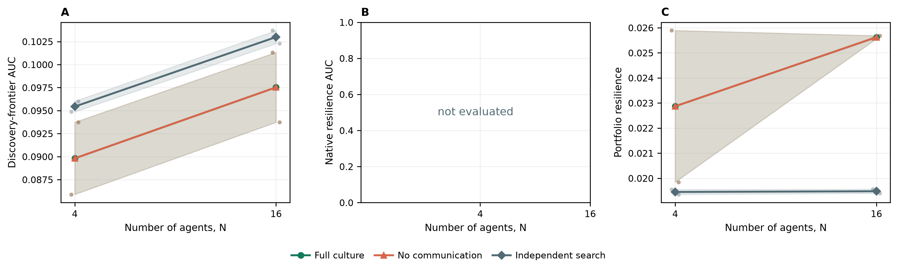

# End-to-end analysis guide

This guide starts with a deterministic study that runs without an API key, follows
its traces through integrity verification and seed-level analysis, and then maps the
same workflow onto the released paper data. It also documents the specialized trace,
mobility, counterfactual, ecosystem, dossier, and technology-atlas tools.

The small scripted study below is a software and mechanics demonstration. It is not
evidence for or against the scientific hypotheses in the paper. The independent
simulation seed—not an agent, artifact, message, or tick—is always the statistical
replicate.

## Analysis commands at a glance

| Command | Input | Main question | Principal outputs |
|---|---|---|---|
| `analyze-study` | one or more `study-summary.json` files | How do endpoints vary across conditions, populations, and seeds? | seed-level CSV, bootstrap intervals, audits, scaling and cultural-gain figures |
| `analyze-mobility` | one or more `study-summary.json` files plus their traces | How do movement, encounters, spatial organization, and behavioral regimes vary? | episode/agent/time-series CSV, embeddings, contrasts, PNG/PDF/SVG figures |
| `trace-report` | one `.jsonl` or `.jsonl.gz` trace | What happened mechanistically in one episode? | diagnostic JSON and optional lineage figure |
| `ecosystem-report` | one shared-society trace | Which frozen artifacts causally support the technological ecosystem? | knockout/generalization JSON and ecology figures |
| `counterfactual-replay` | one compatible action trace | What changes when selected agents' recorded actions are replaced by `WAIT`? | factual/counterfactual comparison JSON |
| `technology-dossiers` | one trace | What technologies were actually recorded, and how can they be presented? | catalog, prompts, briefing sheets, optional concept images |
| `technology-atlas` | one or more study summaries plus traces | Which technologies are high-performing yet semantically distinct across studies? | ranked catalog, embeddings, clusters, figures, PDF report, HTML explorer |

Every command supports `--help`, for example:

```bash
biofoundry analyze-study --help
biofoundry trace-report --help
```

## 1. Install the analysis environment

From the repository root:

```bash
python -m venv .venv
source .venv/bin/activate
python -m pip install --upgrade pip
python -m pip install -e ".[dev,analysis]"
biofoundry doctor --config configs/demo.yaml
```

The `analysis` extra supplies Matplotlib, scikit-learn, sentence-transformers, UMAP,
and PDF support. The deterministic walkthrough does not call or download a language
model. Run commands from the repository root so configuration and relative trace paths
resolve consistently.

## 2. Generate a complete no-key study

This study crosses three conditions, two population sizes, and two seeds:

```bash
biofoundry research-study \
  --config configs/demo.yaml \
  --policy scripted \
  --conditions full no-communication independent-search \
  --population-sizes 4 16 \
  --seeds 3001 3002 \
  --ticks 128 \
  --held-out-evaluation-seeds 9001 9002 \
  --output-dir runs/example-study
```

The command creates 12 canonical condition-population-seed rows. Shared conditions
produce eight traces. Independent search additionally retains all 40 isolated member
traces: `2 seeds × (4 + 16 agents)`. Its canonical summary is the endpoint-wise
best-of-N envelope, not a fictitious N-agent shared world.

The important files are:

```text
runs/example-study/
  study-manifest.json
  study-summary.json
  scripted-full-n-4-seed-3001.jsonl
  scripted-no-communication-n-4-seed-3001.jsonl
  scripted-independent-search-n-4-seed-3001-member-000.jsonl
  ...
```

`study-manifest.json` is written before execution and records the resolved protocol,
interventions, seeds, hashes, engine revision, source commit, and dirty-worktree state.
`study-summary.json` is written only after normal completion and indexes the seed-level
outcomes and trace paths. A manifest by itself does not prove that a study completed.

## 3. Verify a trace before analyzing it

Choose one exact episode and replay it:

```bash
biofoundry replay \
  runs/example-study/scripted-full-n-4-seed-3001.jsonl
```

For the verified engine-revision-9 walkthrough, replay reported:

```text
action_trace_replayed: true
records: 956
snapshots_verified: 6
deterministic_snapshots_verified: 6
final_digest: c1dcd211d551d7a2f276ce83f8b59fe566649f668fbc3110391bed1311b6f5b3
```

Exact action replay is permitted only when the trace's authoritative engine revision
is compatible with the checked-out code. See
[REPRODUCIBILITY.md](REPRODUCIBILITY.md) for the behavior of legacy traces and the
limits of cross-platform floating-point reproducibility.

## 4. Run the seed-level study analysis

For a quick walkthrough, use 2,000 bootstrap resamples:

```bash
biofoundry analyze-study \
  runs/example-study/study-summary.json \
  --output-dir runs/example-study/analysis \
  --bootstrap-resamples 2000
```

Omit `--bootstrap-resamples` to use the default 20,000 resamples for research output.
The analyzer writes machine-readable results before rendering figures.

| Output | Contents |
|---|---|
| `analysis.json` | complete nested analysis and provenance |
| `condition-endpoints.csv` | endpoint estimates pooled by condition |
| `population-scaling.csv` | seed means and intervals by condition and N |
| `cultural-gain.csv` | matched collective minus independent-search estimates |
| `scaling-slopes.csv` | endpoint change per population doubling |
| `pairwise-population-contrasts.csv` | population-level comparisons |
| `design-audit.csv` | condition matching, spawns, scheduling, and engine revision |
| `compute-audit.csv` | decision opportunities, calls, tokens, attempts, and failures |
| `population-scaling.{png,pdf,svg}` | primary endpoint scaling figure |
| `cultural-gain-scaling.{png,pdf,svg}` | matched cultural-gain figure |
| `study-*.{png,pdf}` | overview, portfolio, and technology-ecology summaries |

### Verified example result

These are the means produced by the walkthrough above; each cell contains only two
seeds and is intentionally too small for scientific inference.

| Condition | N | Discovery-frontier AUC | Peak artifact performance | Portfolio resilience |
|---|---:|---:|---:|---:|
| Full culture | 4 | 0.089811 | 0.143743 | 0.022869 |
| No communication | 4 | 0.089811 | 0.143743 | 0.022869 |
| Independent search | 4 | 0.095440 | 0.144063 | 0.019455 |
| Full culture | 16 | 0.097527 | 0.141898 | 0.025624 |
| No communication | 16 | 0.097527 | 0.141898 | 0.025624 |
| Independent search | 16 | 0.102992 | 0.144296 | 0.019483 |



The full and no-communication rows overlap because this scripted fixture does not use
explicit communication; that equality tests intervention plumbing, not the paper's
cultural hypothesis. Panel B reports “not evaluated” because `configs/demo.yaml`
disables the native held-out evaluation suite. The example design audit verifies
matching initial positions, macroturn phases, and engine revision, but correctly does
not mark model decision opportunities as valid because the scripted policy makes no
model calls.

Always inspect `design-audit.csv` and `compute-audit.csv` before interpreting endpoint
figures. A confirmatory LLM study should pass its predeclared design checks; a failed
audit is not repaired by an attractive endpoint result.

## 5. Diagnose one episode

Create a structured trace report and lineage figure:

```bash
biofoundry trace-report \
  runs/example-study/scripted-full-n-4-seed-3001.jsonl \
  --output runs/example-study/trace-report.json \
  --figures-dir runs/example-study/trace-figures
```

The verified walkthrough report found 512 executed actions, five built artifacts,
four program installations, one publication, and a best lifetime artifact performance
of `0.144660`. It also recorded 93 rejected attempts (`0.181641` rejection rate),
including blocked movement and unsuccessful harvesting. These diagnostics explain a
run; they do not create additional statistical replicates.

The JSON includes action outcomes, rejection reasons, model usage and errors,
research-state updates, experimental cycles, messages and replies, publications and
citations, task claims, program culture, artifact ancestry, final research endpoints,
scenario-aware metrics, and source metadata.

## 6. Analyze movement and spatial organization

```bash
biofoundry analyze-mobility \
  runs/example-study/study-summary.json \
  --output-dir runs/example-study/mobility \
  --bootstrap-resamples 2000
```

The walkthrough produces 12 seed-level episode rows and detailed data products such
as:

- `mobility-episodes.csv` and `mobility-time-series.csv`;
- `mobility-agent-dynamics.csv` and `mobility-spatial-time-series.csv`;
- state transitions, paired contrasts, behavioral embeddings, cluster profiles, and
  episode fractions;
- dynamics, population-scaling, self-organization, behavior-embedding,
  behavior-scaling, and condition-facet figures in PNG, PDF, and SVG.

Agent trajectories are used to construct one seed-level observable. Agents within one
society are nested observations and must not be reported as independent replicates.
Independent-search endpoints remain comparable, but isolated agents are never plotted
as though they occupied one shared spatial world.

## 7. Run a deterministic contributor counterfactual

For the worked trace, remove `agent_000000` by replacing that agent's recorded actions
with `WAIT` while replaying everyone else open-loop:

```bash
biofoundry counterfactual-replay \
  runs/example-study/scripted-full-n-4-seed-3001.jsonl \
  --remove-agent agent_000000 \
  --output runs/example-study/counterfactual-agent-000000.json
```

In the verified example, removal reduced the best artifact performance from `0.144660`
to `0.065601`, reduced portfolio resilience by `0.014978`, and left three rather than
five artifacts. This is a deterministic intervention on the recorded action trace,
not a behavioral re-simulation in which other agents adapt to the absence.

Use `--all-claimed` instead of `--remove-agent` to evaluate every claimed contributor
separately.

## 8. Build technology dossiers without an image API

The default dossier workflow extracts only recorded technology content and makes no
image request:

```bash
biofoundry technology-dossiers \
  runs/example-study/scripted-full-n-4-seed-3001.jsonl \
  --output-dir runs/example-study/dossiers \
  --top-k 3
```

The walkthrough extracted three performance-ranked technologies and wrote a manifest,
catalog, prompts, Markdown dossiers, and briefing sheets. Generated pictures are
explanatory illustrations and never simulation evidence. Image generation occurs only
when `--generate` is explicitly supplied and requires the `technology-images` extra
and a configured API key.

## 9. Analyze the released paper studies

Download the companion dataset outside this source checkout as described in
[DATA.md](../DATA.md):

```bash
python -m pip install --upgrade huggingface_hub
hf download lamm-mit/swarmworld-data \
  --repo-type dataset \
  --local-dir ../swarmworld-data
```

Verify the dataset's own SHA-256 inventory before analysis:

```bash
python ../swarmworld-data/scripts/verify_dataset.py \
  --dataset-root ../swarmworld-data
```

Regenerate the common 800-tick, four-condition, three-population analysis from the
eight constituent study summaries:

```bash
biofoundry analyze-study \
  ../swarmworld-data/studies/study_800tick_n050_full_independent/study-summary.json \
  ../swarmworld-data/studies/study_800tick_n050_culture_ablations/study-summary.json \
  ../swarmworld-data/studies/study_800tick_n100_full_independent/study-summary.json \
  ../swarmworld-data/studies/study_800tick_n100_no_explicit_culture/study-summary.json \
  ../swarmworld-data/studies/study_800tick_n100_no_communication/study-summary.json \
  ../swarmworld-data/studies/study_800tick_n200_full_independent/study-summary.json \
  ../swarmworld-data/studies/study_800tick_n200_no_explicit_culture/study-summary.json \
  ../swarmworld-data/studies/study_800tick_n200_no_communication/study-summary.json \
  --output-dir runs/paper-analysis-800tick
```

Use the same eight summaries with `analyze-mobility` to regenerate the movement and
spatial self-organization products:

```bash
biofoundry analyze-mobility \
  ../swarmworld-data/studies/study_800tick_n050_full_independent/study-summary.json \
  ../swarmworld-data/studies/study_800tick_n050_culture_ablations/study-summary.json \
  ../swarmworld-data/studies/study_800tick_n100_full_independent/study-summary.json \
  ../swarmworld-data/studies/study_800tick_n100_no_explicit_culture/study-summary.json \
  ../swarmworld-data/studies/study_800tick_n100_no_communication/study-summary.json \
  ../swarmworld-data/studies/study_800tick_n200_full_independent/study-summary.json \
  ../swarmworld-data/studies/study_800tick_n200_no_explicit_culture/study-summary.json \
  ../swarmworld-data/studies/study_800tick_n200_no_communication/study-summary.json \
  --output-dir runs/paper-mobility-800tick
```

Analyze the temporal crossover study separately; do not pool it with the 800-tick
cross-sectional design:

```bash
biofoundry analyze-study \
  ../swarmworld-data/studies/study_3200tick_n100_cultural_crossover/study-summary.json \
  --output-dir runs/paper-analysis-3200tick
```

The exact commands that generated all nine studies are retained with the dataset in
[`metadata/run_commands.md`](https://huggingface.co/datasets/lamm-mit/swarmworld-data/blob/main/metadata/run_commands.md).
Each study manifest is the authoritative record of its resolved protocol and hashes.

## 10. Run the artifact-ecology assay

Select a predeclared shared-society trace and held-out disturbance seeds:

```bash
biofoundry ecosystem-report \
  ../swarmworld-data/studies/study_800tick_n050_full_independent/\
llm-full-n-50-seed-3201.jsonl.gz \
  --output-dir runs/ecosystem-n50-seed3201 \
  --evaluation-seeds 9201 9202 9203 9204 9205 9206 9207 9208
```

The assay freezes the discovered society, removes agents, applies unseen disturbance
schedules, and measures artifact-level and pairwise knockout effects. It distinguishes
functional ecological support from names, messages, citations, or model-written
claims. Use seed-level estimates for inference; a single representative report is a
mechanistic case study.

## 11. Build a cross-study technology atlas

For a completely local demonstration, use TF-IDF embeddings and do not pass
`--generate`:

```bash
biofoundry technology-atlas \
  runs/example-study/study-summary.json \
  --conditions full no-communication independent-search \
  --featured-count 4 \
  --embedding-provider tfidf \
  --output-dir runs/example-study/atlas
```

The verified walkthrough collected 136 recorded technologies across 48 traces,
selected four high-performing semantically distinct examples, and generated a ranked
catalog, embedding tables, cluster audit, PNG/PDF/SVG figures, a PDF report, and a
data-driven `technology-explorer.html`. Serve the explorer over HTTP:

```bash
python -m http.server 8766 --directory runs/example-study/atlas
```

Open `http://127.0.0.1:8766/technology-explorer.html`. The default
`embeddinggemma` provider gives a denser semantic representation when its local model
checkpoint is available; the OpenAI embedding and image paths are opt-in.

## Interpretation and reporting checklist

- Treat each independent simulation seed as one replicate.
- Report every seed, including provider failures and zero-artifact episodes.
- Inspect design and compute audits before endpoint plots.
- Distinguish peak lifetime performance from final-state performance.
- Compare a collective against the matched best-of-N independent-search envelope;
  scaling relative to one agent is not by itself a swarm advantage.
- Report missing ecological endpoints as “not evaluated,” never as zero.
- Keep the 800-tick cross-sectional and 3,200-tick temporal designs separate.
- State the engine revision, source commit, dirty state, model/provider identity,
  configuration hash, prompt hash, action-schema hash, seed block, and bootstrap count.
- Treat dossiers and generated images as explanatory presentation, not measured data.

For experimental claims and exclusions, read
[FLAGSHIP_EXPERIMENT.md](FLAGSHIP_EXPERIMENT.md) and
[REPRODUCIBILITY.md](REPRODUCIBILITY.md).
